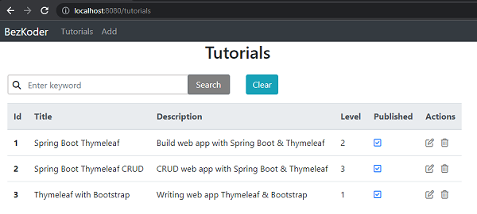

# Spring Boot Thymeleaf 

Project example: 



Database example project in `db/db.sql`

## Requirements
Java: 11
Maven: 3.8 

## Build code Spring Boot by Maven
```
mvn clean package
```

## Run Spring Boot application
```
mvn spring-boot:run
```

## Run with docker

```bash
docker-compose up --build -d
```

## Check result: <host>:8080/ex1/tutorials?user=user1&key=<*****>

